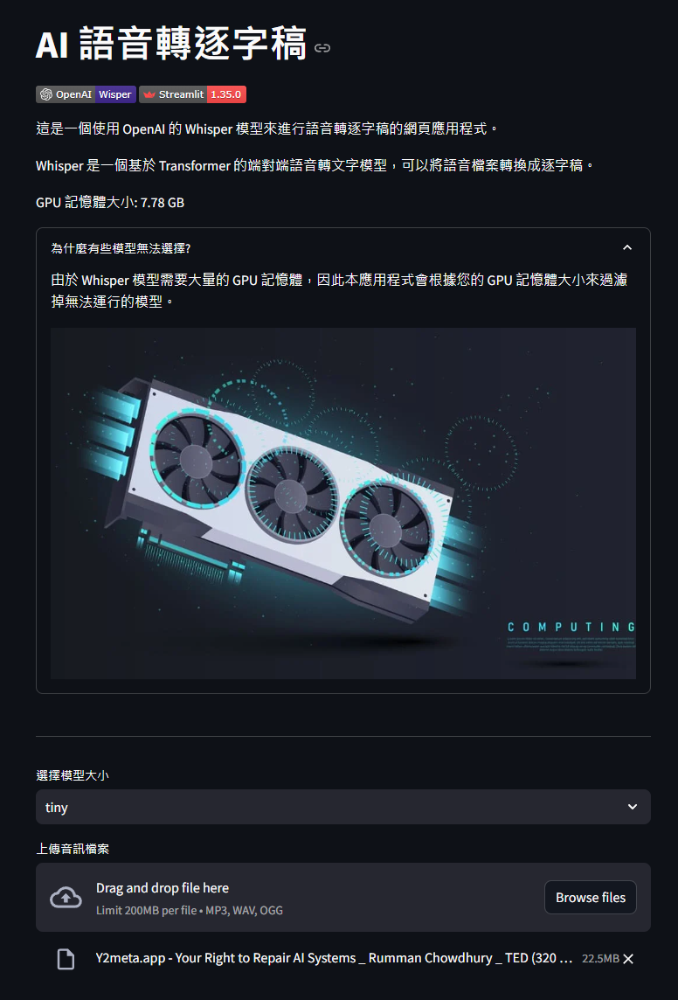
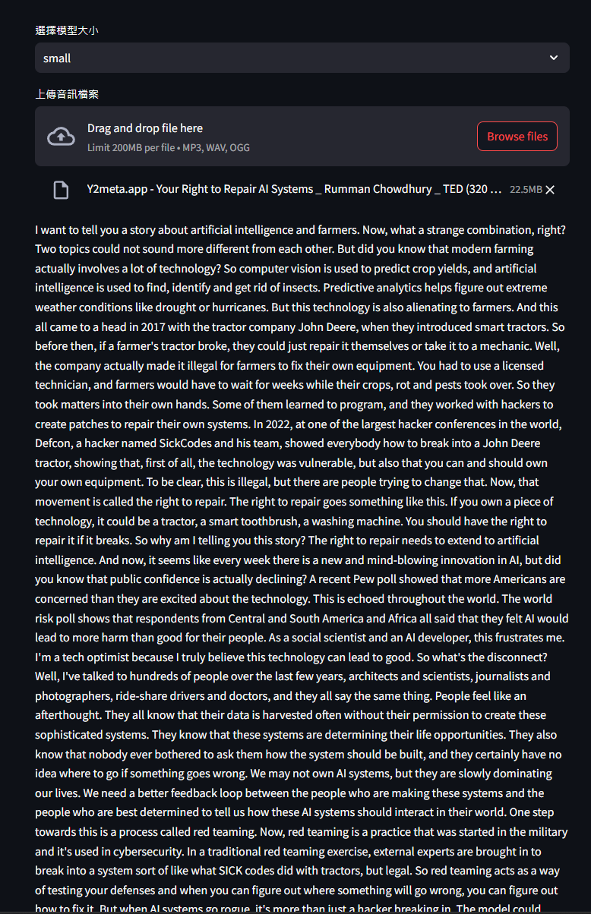
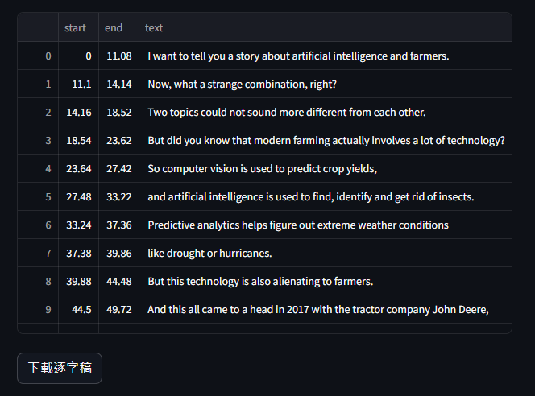

<!--
 * @Author: hibana2077 hibana2077@gmail.com
 * @Date: 2024-06-15 08:44:13
 * @LastEditors: hibana2077 hibana2077@gmail.com
 * @LastEditTime: 2024-06-15 10:28:32
 * @FilePath: \wisper_ui\README.md
 * @Description: 这是默认设置,请设置`customMade`, 打开koroFileHeader查看配置 进行设置: https://github.com/OBKoro1/koro1FileHeader/wiki/%E9%85%8D%E7%BD%AE
-->
# Wisper UI

 

## Introduction

This is a lightweight Streamlit application designed for efficient and accurate speech-to-text conversion using OpenAI's Whisper model. The application is intuitive and easy to use, featuring several key functionalities:

- **Model Selection**: Users can choose from different versions of the Whisper model to optimize performance and accuracy according to their needs.
- **Audio File Upload**: Supports uploading of audio files in various formats, allowing users to easily load the speech data they wish to convert.
- **CSV Export Functionality**: The converted text can be conveniently exported to a CSV file, facilitating further analysis or archiving.

This application is ideal for individuals or teams who need quick and accurate transcription, whether for academic research, meeting records, or daily office work, delivering excellent results in all scenarios.

## Installation

To run this application, you must have Docker installed on your system with GPU support. If Docker is not already installed, download it from the [official Docker website](https://www.docker.com/).

### Step-by-Step Installation

1. **Clone the Repository**:
   Open your terminal and execute the following commands to clone the repository:

   ```bash
   git clone https://github.com/hibana2077/wisper_ui.git
   cd wisper_ui
   ```

2. **Run Docker Compose**:
   Build and deploy the Docker containers using the command:

   ```bash
   docker-compose up -d --build
   ```

3. **Access the Application**:
   - **Locally**: Navigate to `http://localhost:8501` in your web browser to access the application.
   - **Online**: Alternatively, you can access the application through the hosted version on [Hugging Face Spaces](https://huggingface.co/spaces/hibana2077/wisper_ui).

These steps will set up the application, allowing you to use the powerful speech-to-text features powered by OpenAI’s Whisper model.

## Usage

The application interface is user-friendly and intuitive, making it easy to convert speech to text with just a few simple steps:

1. **Select Model**: Choose the Whisper model version that best suits your needs.
2. **Upload Audio File**: Click the "Upload Audio File" button and select the audio file you wish to convert.
3. **Convert Speech**: When the audio file is uploaded, application will automatically convert the speech to text.
4. **Export to CSV**: If desired, you can export the converted text to a CSV file by clicking the "Export to CSV" button.

## Roadmap

Here's what we've achieved and what's planned for the future development of the application:

- [x] **Implemented a basic Streamlit application with Whisper model integration.**
- [x] **Added support for multiple Whisper model versions.**
- [x] **Enabled audio file upload and conversion to text.**
- [x] **Implemented CSV export functionality for converted text.**
- [ ] **Automatic summarization of key points.** (In progress)
- [ ] **Automatic speaker detection.** (Planned)
- [ ] **Mind map generation from transcribed texts.** (Planned)

## Demo







## Contributing

Contributions are welcome and encouraged! If you have any suggestions, bug reports, or feature requests, please feel free to open an issue or submit a pull request. Your feedback and contributions will help improve the application and make it more useful for everyone.

## License

This project is licensed under the MIT License. For more information, please refer to the [LICENSE](./LICENSE) file.